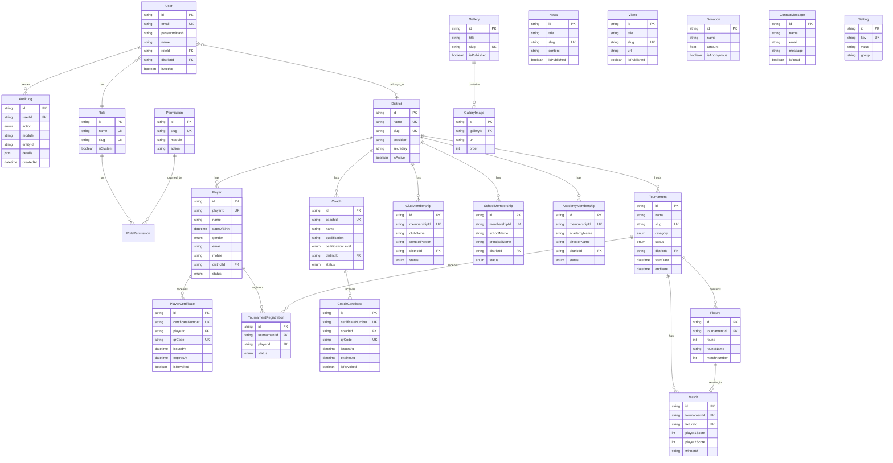
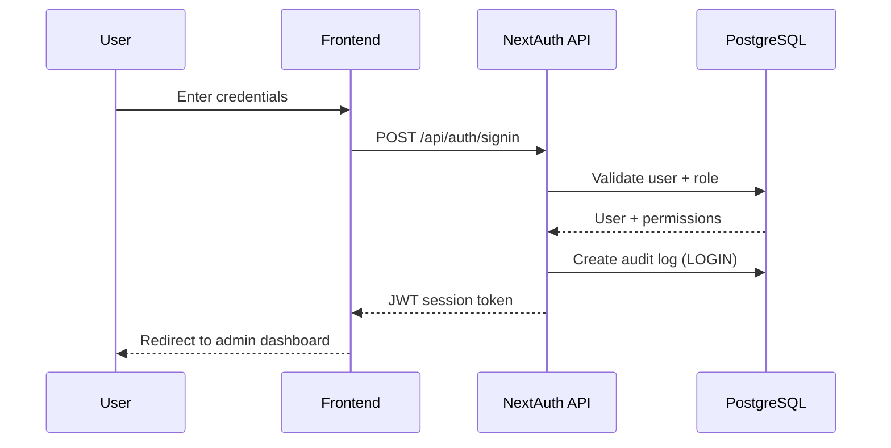
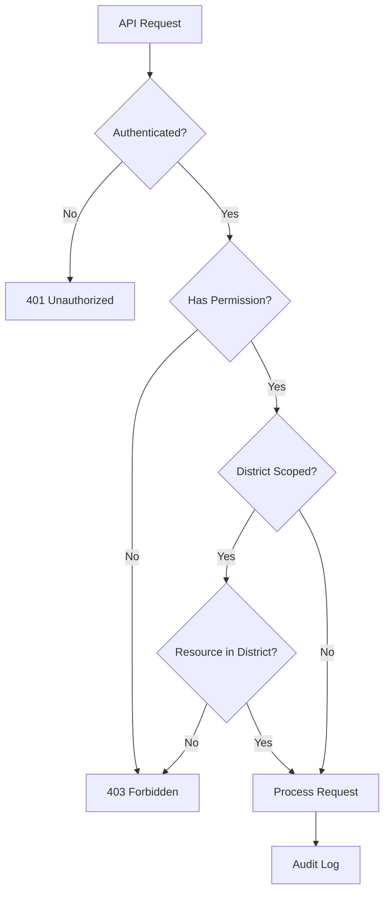
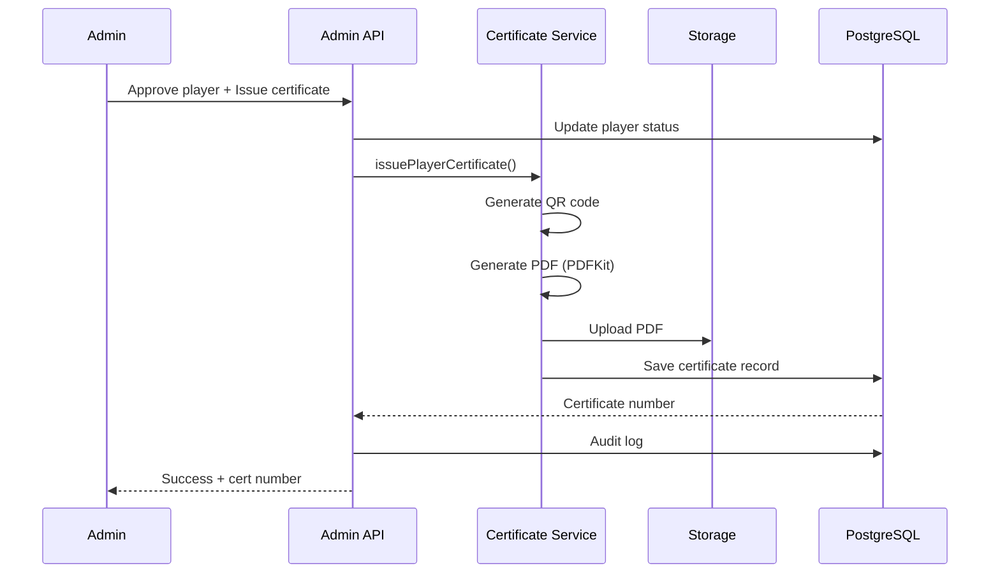

# Database ER Diagram

## Entity Relationship Overview

```mermaid
erDiagram
    User ||--o{ AuditLog : creates
    User }o--|| Role : has
    User }o--o| District : belongs_to
    Role ||--o{ RolePermission : has
    Permission ||--o{ RolePermission : granted_to

    District ||--o{ Player : has
    District ||--o{ Coach : has
    District ||--o{ ClubMembership : has
    District ||--o{ SchoolMembership : has
    District ||--o{ AcademyMembership : has
    District ||--o{ Tournament : hosts

    Player ||--o{ PlayerCertificate : receives
    Player ||--o{ TournamentRegistration : registers

    Coach ||--o{ CoachCertificate : receives

    Tournament ||--o{ TournamentRegistration : accepts
    Tournament ||--o{ Fixture : contains
    Tournament ||--o{ Match : has

    Fixture ||--o| Match : results_in

    Gallery ||--o{ GalleryImage : contains

    User {
        string id PK
        string email UK
        string passwordHash
        string name
        string roleId FK
        string districtId FK
        boolean isActive
    }

    Role {
        string id PK
        string name UK
        string slug UK
        boolean isSystem
    }

    Permission {
        string id PK
        string slug UK
        string module
        string action
    }

    District {
        string id PK
        string name UK
        string slug UK
        string president
        string secretary
        boolean isActive
    }

    Player {
        string id PK
        string playerId UK
        string name
        datetime dateOfBirth
        enum gender
        string email
        string mobile
        string districtId FK
        enum status
    }

    Coach {
        string id PK
        string coachId UK
        string name
        string qualification
        enum certificationLevel
        string districtId FK
        enum status
    }

    PlayerCertificate {
        string id PK
        string certificateNumber UK
        string playerId FK
        string qrCode UK
        datetime issuedAt
        datetime expiresAt
        boolean isRevoked
    }

    CoachCertificate {
        string id PK
        string certificateNumber UK
        string coachId FK
        string qrCode UK
        datetime issuedAt
        datetime expiresAt
        boolean isRevoked
    }

    ClubMembership {
        string id PK
        string membershipId UK
        string clubName
        string contactPerson
        string districtId FK
        enum status
    }

    SchoolMembership {
        string id PK
        string membershipId UK
        string schoolName
        string principalName
        string districtId FK
        enum status
    }

    AcademyMembership {
        string id PK
        string membershipId UK
        string academyName
        string directorName
        string districtId FK
        enum status
    }

    Tournament {
        string id PK
        string name
        string slug UK
        enum category
        enum status
        string districtId FK
        datetime startDate
        datetime endDate
    }

    TournamentRegistration {
        string id PK
        string tournamentId FK
        string playerId FK
        enum status
    }

    Fixture {
        string id PK
        string tournamentId FK
        int round
        string roundName
        int matchNumber
    }

    Match {
        string id PK
        string tournamentId FK
        string fixtureId FK
        int player1Score
        int player2Score
        string winnerId
    }

    News {
        string id PK
        string title
        string slug UK
        string content
        boolean isPublished
    }

    Video {
        string id PK
        string title
        string slug UK
        string url
        boolean isPublished
    }

    Gallery {
        string id PK
        string title
        string slug UK
        boolean isPublished
    }

    GalleryImage {
        string id PK
        string galleryId FK
        string url
        int order
    }

    AuditLog {
        string id PK
        string userId FK
        enum action
        string module
        string entityId
        json details
        datetime createdAt
    }

    Donation {
        string id PK
        string name
        float amount
        boolean isAnonymous
    }

    ContactMessage {
        string id PK
        string name
        string email
        string message
        boolean isRead
    }

    Setting {
        string id PK
        string key UK
        string value
        string group
    }
```

## Authentication Flow

```mermaid
sequenceDiagram
    participant U as User
    participant F as Frontend
    participant A as NextAuth API
    participant DB as PostgreSQL

    U->>F: Enter credentials
    F->>A: POST /api/auth/signin
    A->>DB: Validate user + role
    DB-->>A: User + permissions
    A->>DB: Create audit log (LOGIN)
    A-->>F: JWT session token
    F-->>U: Redirect to admin dashboard
```

## RBAC Authorization Flow

```mermaid
flowchart TD
    A[API Request] --> B{Authenticated?}
    B -->|No| C[401 Unauthorized]
    B -->|Yes| D{Has Permission?}
    D -->|No| E[403 Forbidden]
    D -->|Yes| F{District Scoped?}
    F -->|Yes| G{Resource in District?}
    G -->|No| E
    G -->|Yes| H[Process Request]
    F -->|No| H
    H --> I[Audit Log]
```

## Certificate Issuance Flow

```mermaid
sequenceDiagram
    participant A as Admin
    participant API as Admin API
    participant S as Certificate Service
    participant ST as Storage
    participant DB as PostgreSQL

    A->>API: Approve player + Issue certificate
    API->>DB: Update player status
    API->>S: issuePlayerCertificate()
    S->>S: Generate QR code
    S->>S: Generate PDF (PDFKit)
    S->>ST: Upload PDF
    S->>DB: Save certificate record
    DB-->>API: Certificate number
    API->>DB: Audit log
    API-->>A: Success + cert number
```
